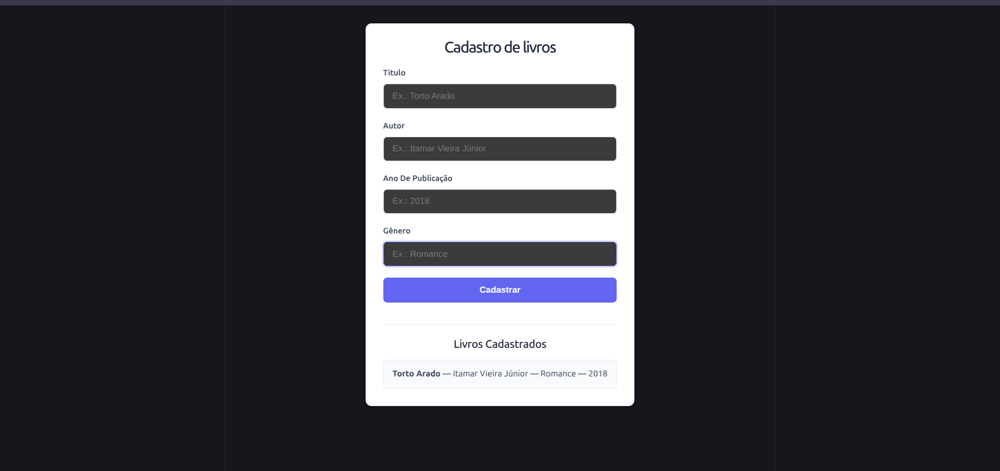

# 📚 Cadastro de Livros

Uma aplicação web simples e reativa desenvolvida em React para gerenciamento e cadastro de livros. O projeto permite cadastrar obras informando título, autor, ano de publicação e gênero, exibindo-as em uma lista em tempo real.

---

## 📸 Demonstração

Aqui está uma prévia da interface do sistema:



---

## 🚀 Tecnologias Utilizadas

O projeto foi desenvolvido utilizando as seguintes tecnologias:

- **React** (Componentização, Hooks: `useState`)
- **CSS Modules** (Estilização escopada e modular)
- **JavaScript (ES6+)**
- **HTML5**

---

## 🎨 Funcionalidades

- [x] Formulário para cadastro de livros.
- [x] Atualização da lista de livros em tempo real.
- [x] Limpeza automática dos campos após a submissão.
- [x] Layout moderno, responsivo e amigável.

---

## 🛠️ Como Executar o Projeto

### Pré-requisitos
Antes de começar, você precisará ter instalado em sua máquina o [Node.js](https://nodejs.org/) e um gerenciador de pacotes (como o **npm** ou **yarn**).

### Passo a Passo

1. **Clone este repositório:**
   ```bash
   git clone [https://github.com/seu-usuario/seu-repositorio.git](https://github.com/seu-usuario/seu-repositorio.git)
    ```

2. **Acesse a página do projeto**
    ```bash
    cd atividade-formulario
    ```

3. **Instale as dependências**
    ```bash
    npm install
    ```

4. **Inicie o servidor**
    ```bash
    npm run dev
    ```

5. **Acesse no seu navegador**
    O aplicativo estará rodando em http://localhost:5173 ou http://localhost:3000

## 📂 Estrutura de Arquivos
```
src/
├── components/
│   ├── CampoTexto.jsx
│   ├── CampoTexto.module.css
│   ├── FormularioLivro.jsx
│   ├── FormularioLivro.module.css
│   ├── Livro.jsx
│   └── assets/
│       └── screenshot.png
├── App.jsx
├── main.jsx
└── index.css
```

# atividade-formulario
